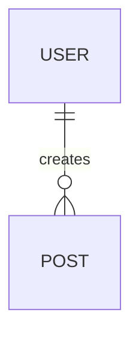

# System Architecture

## 1. 기술 스택
* Frontend: 
* Backend: 

## 2. 데이터베이스 스키마

## 3. API 명세서
| Method | Endpoint | Description | Request | Response |
|---|---|---|---|---|
| GET | /api/... | ... | ... | ... |
