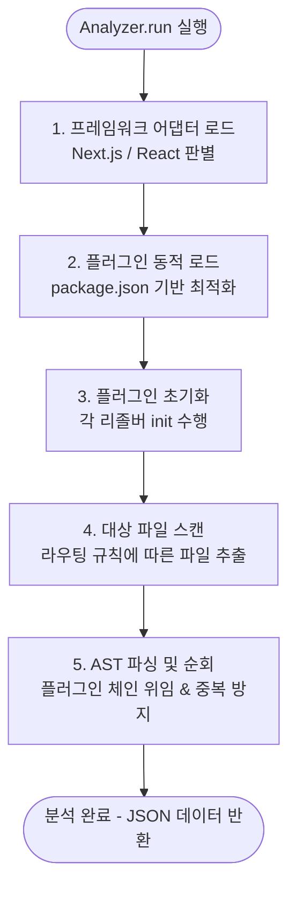

# get-front-code-4 아키텍처 및 기획서 구현 맵핑 가이드

본 문서는 기획서(`plan-2.md`)에서 정의된 핵심 아키텍처와 기능들이 실제 코드의 **어느 위치(파일 및 라인)**에 구현되어 있는지 안내하는 가이드입니다. 
새로운 팀원이 프로젝트를 파악하거나, 기획서의 내용을 코드로 검증할 때 이 문서를 나침반으로 활용하시기 바랍니다.

---

## 🚀 코어 엔진 실행 흐름 (Analyzer Pipeline)
전체 파이프라인의 중심인 `src/core/analyzer.ts` 파일의 `run()` 메서드에서 실제로 작동하는 5단계 분석 흐름입니다.

1. **프레임워크 어댑터 로드**: `package.json`을 검사해 React/Next.js 환경을 판별하고 분석용 어댑터를 생성합니다.
2. **플러그인 동적 로드 (최적화)**: 의존성을 분석하여 프로젝트가 실제로 사용하는 라이브러리(React Query, RTK Query 등)의 전담 리졸버만 선택적으로 메모리에 올립니다.
3. **플러그인 초기화**: 각 리졸버가 분석 전 필요한 사전 작업(전역 API 설정 파일 사전 스캔 등)을 수행합니다.
4. **대상 파일 스캔**: 어댑터의 프레임워크 라우팅 규칙에 따라 분석이 필요한 핵심 UI 컴포넌트 파일들만 고속으로 스캔합니다.
5. **AST 파싱 및 순회 (API 추출)**: 파일들을 AST로 변환하고 순회하며, 플러그인 체인(Chain of Responsibility)을 통해 API 호출을 추출하고 중복을 제거합니다.

---

## 4. 핵심 아키텍처: 다중 레이어 구조 및 관심사 분리
- **구현 위치**: `src/core/analyzer.ts`, `src/app/api/analyze/route.ts`, `src/app/page.tsx`
- **주요 코드 흐름**:
  - 패키지 의존성(`package.json`) 기반으로 최적화된 리졸버(Resolver)만 동적 로드: `src/core/analyzer.ts` (Line 28-48)
  - 관심사 분리(백엔드는 JSON 데이터 가공, 프론트엔드는 UI 렌더링 전담): `src/app/api/analyze/route.ts` & `src/app/page.tsx`

## 5. 프레임워크 분석 어댑터 (Framework Adapters)
### 5.1. Next.js App Router 서버/클라이언트 구분
- **구현 위치**: `src/adapters/index.ts`, `src/adapters/next-adapter.ts`
- **주요 코드 흐름**:
  - 미지원 프레임워크(Vue, Svelte 등) 감지 및 분석 차단(Fail-fast): `src/adapters/index.ts` (Line 19-44)
  - `'use client'`, `'use server'` 지시어 및 폴더 경로를 분석하여 컴포넌트 호출 유형(Server/Client) 구분: `src/adapters/next-adapter.ts` (Line 48-69)

## 6. 데이터 페칭 라이브러리 지원 (Plugin Resolvers)
엔진(Traverser) 자체는 특정 통신 라이브러리의 문법을 몰라도 되도록, 플러그인(Resolver)들이 각자의 패턴 추적 역할을 전담합니다.
- **구현 위치**: `src/core/resolvers/` 폴더 하위
- **주요 구현체**:
  - **Axios & Fetch**: `src/core/resolvers/axios-fetch-resolver.ts`
  - **React Query**: `src/core/resolvers/react-query.ts`
  - **RTK Query**: `src/core/resolvers/rtk-query.ts`
  - **SWR**: `src/core/resolvers/swr-resolver.ts`

## 7. 품질 고도화 및 안정성 보장 전략

### 7.1. 리졸버 간 우선순위 및 배타 규칙 (Chain of Responsibility & Fallback)
고수준 라이브러리(React Query 등) 내에 저수준 라이브러리(Axios 등)가 혼재되어 있을 때, 하나의 API 호출이 중복으로 추출되는 것을 막기 위한 가장 핵심적인 보호 로직입니다.
- **구현 위치**: `src/core/ast-traverser.ts`
- **주요 코드 흐름**:
  - 등록된 Resolver 순서대로 파싱을 위임하고, 성공 시 `path.skip()`을 호출하여 하위 AST(예: queryFn 내부의 axios.get) 탐색을 원천 차단(배타적 소유): `src/core/ast-traverser.ts` (Line 63-72)
  - 고수준 훅이 매칭만 되고 실패했을 땐 하위 리졸버로 위임(`continue` 활용한 Fallback): `src/core/ast-traverser.ts` (Line 73-76)

### 7.2. 단일 화면 내 중복 제거 (Deduplication)
- **구현 위치**: `src/core/analyzer.ts`
- **주요 코드 흐름**:
  - 한 화면(viewName)에서 동일한 API(Method + Endpoint)를 여러 번 호출할 경우, `Set` 객체를 활용해 중복 카운팅 방지: `src/core/analyzer.ts` (Line 78-85)

### 7.5. 환경/빌드 레벨 안정성 확보 (JSDoc 충돌 방지 및 Error Recovery)
- **구현 위치**: `src/core/ast-parser.ts`
- **주요 코드 흐름**:
  - Babel 파싱 과정에서 JSDoc 특수 문자 등으로 트리 붕괴가 일어나지 않도록 `errorRecovery: true` 모드 활성화: `src/core/ast-parser.ts` (Line 19)

## 8. 파싱 실패 처리 전략 (Fail-safe)
- **구현 위치**: `src/core/ast-parser.ts`
- **주요 코드 흐름**:
  - 특정 파일 파싱 시 오류가 나더라도, 파이프라인 전체가 크래시되지 않도록 `try-catch`로 감싸고 스킵(null 반환) 처리: `src/core/ast-parser.ts` (Line 21-25)

## 9. 최종 산출물 포맷 및 모던 UI 리포트
- **구현 위치**: `src/app/page.tsx`
- **주요 코드 흐름**:
  - HTTP Method(`GET`, `POST` 등)에 따라 화려한 뱃지 컬러(Tailwind CSS) 분기 처리: `src/app/page.tsx` (Line 69-78)
  - 추출된 API 목록을 컴포넌트별로 그룹핑하여 아코디언 `
` 뷰로 출력: `src/app/page.tsx` (Line 212-250)
